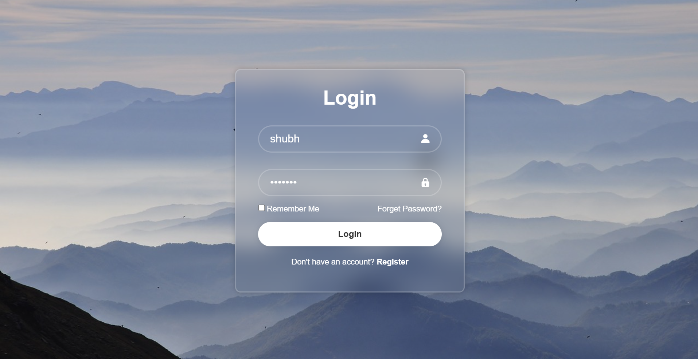

# login-form
Create a login page

# 🔐 Login Form

A simple and responsive login form built with HTML and CSS. Ideal for use in web applications requiring user authentication.

## 🚀 Features

- Responsive design
- Input validation (username & password)
- Remember user details toggle

## 📸 Preview



## 🛠️ Technologies Used

- HTML5
- CSS3

## 🧑‍💻 Getting Started

Clone the repository:

```bash
git clone https://ankitathorve.github.io/login-form
cd login-form


